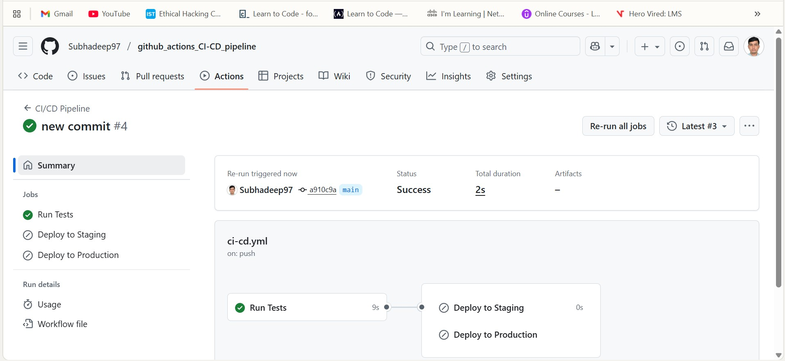
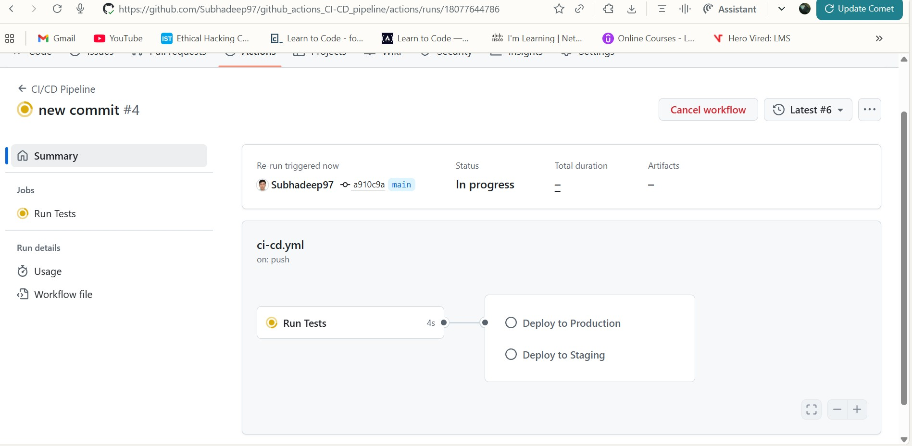

# Flask CI/CD Pipeline 

Flask application with CI/CD pipeline using GitHub Actions.


### Prerequisites
- Python 3.9 or higher
- Git
- GitHub account

## Local Setup

1. **Clone this repository**
---bash
git https://github.com/Subhadeep97/github_actions_CI-CD_pipeline.git


2. **Create a virtual environment**
---bash
python -m venv venv
source venv/bin/activate


3. **Install dependencies**
---bash
pip install -r requirements.txt


4. **Run the application**
---bash
python app.py


5. **Visit your app**
Open your browser and go to: http://localhost:5000

### Test the Application

Run tests to make sure everything works:
---bash
pytest -v

------


## CI/CD Pipeline Explanation

Our GitHub Actions workflow automatically:

### 1. **Runs Tests** (on every push and pull request)
- Sets up Python environment
- Installs dependencies
- Runs all tests
- Only continues if tests pass

### 2. **Deploy to Staging** (when you push to `staging` branch)
- Waits for tests to pass
- Simulates deployment to staging environment
- Runs health checks

### 3. **Deploy to Production** (when you create a release)
- Waits for tests to pass
- Simulates deployment to production
- Runs health checks
- Sends success notification

## 6. How to Use the Pipeline

### For Regular Development:
1. Make changes to your code
2. Push to `main` branch
3. GitHub Actions will automatically run tests

### For Staging Deployment:
1. Create a `staging` branch: `git checkout -b staging`
2. Push changes to staging: `git push origin staging`
3. GitHub Actions will test and deploy to staging

### For Production Deployment:
1. Go to your GitHub repository
2. Click "Releases" → "Create a new release"
3. Tag version (e.g., `v1.0.0`) and publish
4. GitHub Actions will automatically deploy to production

## Setting Up GitHub Secrets (For Real Deployments)

When you're ready for real deployments, you'll need to add secrets:

1. Go to your GitHub repository
2. Click **Settings** → **Secrets and variables** → **Actions**
3. Click **New repository secret**


## Workflow Status Badges

The `.github/workflows/ci-cd.yml` file contains our pipeline. Here's what each part does:

---yaml
# Trigger conditions
on:
  push:
    branches: [ main, staging ]  # Run on pushes to these branches
  pull_request:
    branches: [ main ]           # Run on PRs to main
  release:
    types: [published]           # Run on new releases
```

```yaml
# Jobs run in parallel unless specified otherwise
jobs:
  test:           # Always runs first
  deploy-staging: # Runs after tests, only on staging branch
  deploy-production: # Runs after tests, only on releases
```








